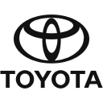
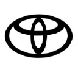

# 🧠 Logo Similarity Challenge

This project explores various methods to **scrape logos from the web**, extract features, and **cluster similar brand logos** using computer vision techniques.

---

## 🌐 Web Scraping Performance

Attempted to extract logos from **4,384 domains** using a combination of APIs and scraping strategies. The best accuracy achieved was:

- ✅ **98.19% success** rate using a hybrid of multiple techniques

### 📈 Strategy Comparison:

| Method                                                                | % of Total              |
|-----------------------------------------------------------------------|-------------------------|
| Clearbit API                                                          | 84%                     |
| Clearbit API + Logo SVG Scraping (`*logo*.svg`)                       | 89%                     |
| Clearbit API + "Largest Logo" (heuristic on image size + filename)    | 100% ( but a lot of noise) |
| Clearbit API + Logo SVG Scraping +  Favicon Scraping + "Largest Logo" | 98.19%✅                 | 

### Best Method Breakdown
| Method                                                  | Count | Coverage |
|---------------------------------------------------------|-------|----------|
| Clearbit API                                            | 2912  | 86.77%   |
| Logo SVG Scraping                                       | 203   | 6.05%    |
| Favicon Scraping                                        | 241   | 7.18 %   |
| "Largest Logo"                                          | 0     | 0%       |

### The output logos can be found in [this kaggle dataset](https://www.kaggle.com/datasets/mihaildanutdogaru/logo-similarity-data) containing:
- `extraction_method.csv` file with the logo extraction method
- `extracted_logos` dir containing the raw logos
- `resized_logos` dir with all logos resized to *128x128* pixels
- `logos.snappy.parquet` file containing the original domain names

---

### Notes
The order of the methods tried for logo extraction in the final combination is due to the following:

- Clearbit API did an amazing job with most of the websites

- The idea of taking the `.svg` comes from the observation that most of the websites
have the main logo in this format, but it doesnt address the problem of other formats.

- In some cases, the logo is the biggest image on the main page, so taking the largest image
containing `*logo*` does sometimes work, but some webstores have products of larger sizes, ruining it.

- In more cases, the favicon had the same exact image as the logo, an example where it is not the same would be [ebay.com](https://www.ebay.com/)
where the favicon is a little shopping bag and not the name, but this method
is more reliable than the largest picture stated above.

- Attempting to extract logos via URL query parameters yielded no improvement.

- You can consult the `extraction_method.csv` to visually see the results of each method
## 🤖 Clustering Approaches

Explored different combinations of image preprocessing and feature extraction techniques to group similar logos using **DBSCAN** and **ResNet** embeddings.

---
> RGBA: Transparent RGB images  
> LA: Transparent Grayscale Images
### 📌 DBSCAN Clustering

### Hyperparameters:
- Epsilon: 2
- Min_samples: 2
#### Without Preprocessing:
- **RGBA**: 1,939 / 3,356 unclustered  
- **LA**: 1,911 / 3,356 unclustered

#### With Center Cropping (128x128 to 40x40):
- **LA**: Improved separation, 1,794 unclustered  
  - ✅ Much better for cases like **AAMCO** with many variations  
- **RGBA**: 1,935 unclustered

#### Blur + Crop:
- Around **2,300 logos marked as noise**, only ~1,000 successfully grouped  
- Performance was worse, potentially **overfitting**, only recognizing perfectly identical logos

#### Blur + Crop + Gaussian Noise:
- **RGBA**: 217 groups found, but **~75% marked as noise**  
- **LA**: Completely failed — **0 groups formed**, everything considered noise

#### Zernike Polynomials:
- ❌ Performance was **very poor**, not usable for this task

---

### What makes 2 logos similar?
Is it the shape? Colors? Style?

This question is too subjective, withoud a concrete definition, finding such a relationship
between images is no easy task, also using classic image processing
features become an issue, so a ML approach seems like the choice.

Blur effects seem to have a negative impact so an attempt would be a ResNet, 
fixing this problem with skip connections.

---

### 🧬 ResNet Feature Clustering

Using pre-trained ResNet50 embeddings for image similarity:

| Method                  | Unclustered Logos / Total |
|-------------------------|---------------------------|
| ResNet (plain)          | 1,634 / 3,356✅            |
| ResNet + Gaussian Noise | 3,272 / 3,356             |
| ResNet + Jitter         | 2,624 / 3,356             |

--- 
## Final results 
- Can be found in `labeled_data.zip`
- The prefix number represents the corresponding group
- Prefix `-1` means the logo is not contained in any class

---

## Failed Non-Trivial Examples
The model couldnt generalize differences like adding the company name in the logo

## Interesting Examples
The model did sometimes manage to group non-perfectly matching logos

## Inter-class Mismatching Cases

## Potential Ideas

There has been an attempt to construct a graph:
- each logo representing a node
- if the `ssim` is over an empirically found threshold, we draw an edge
  - we can find more metrics beyond `ssim` and compute a score, such as `correlation coefficient` or even compute it after applying a sharpening filter over a grayscaled version to get an overall shape, or more gaussian filters on the RGB version to only get the dominant colors 
- in the end find all the connected compoments

This idea falls short, as it has a complexity of O(n^2) taking around 40min for 4000 images even with multithreading

